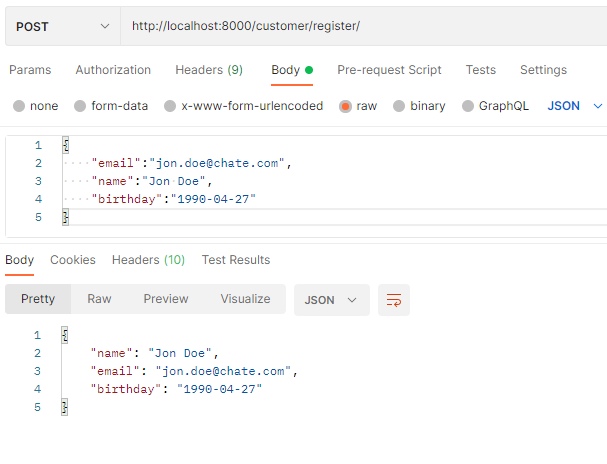
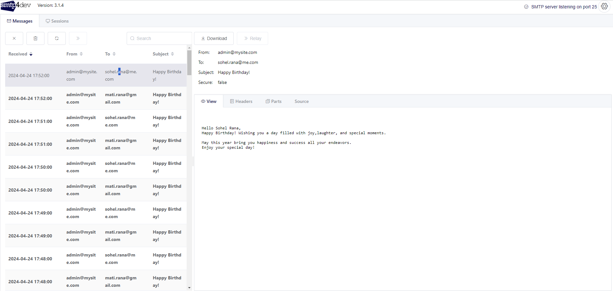
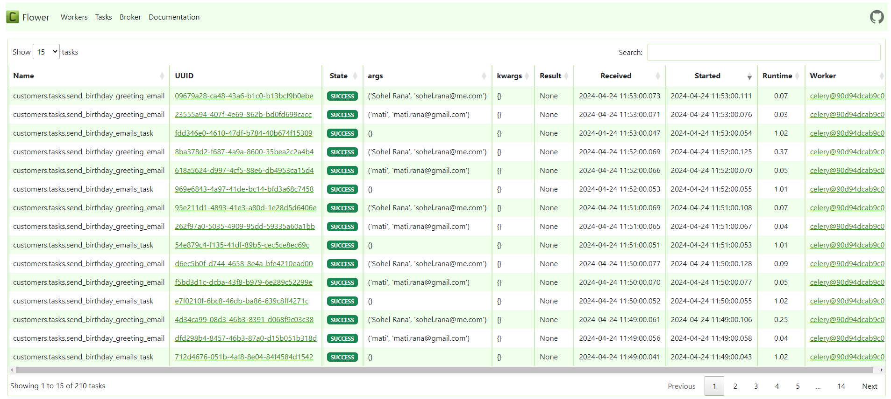

# Birthday Greeting Sender

## Description

An application built using Python and Django Rest Framework, designed to automatically send birthday greetings to customers.

## Requirements

Software

- Python 3+
- Django Rest Framework
- Celery
- Celery Beat
- Flower
- smtp4dev
- Redis
- Docker

Style Guide

- [black](https://github.com/psf/black)
- [Flake8](https://flake8.pycqa.org/en/latest/)
- [isort](https://pypi.org/project/isort/)

### Installation and Run the project

follow the below steps

- make virtual environment

  `python -m venv env`

- activate the virtual environment in windows

  `.\env\Scripts\activate`

- activate the virtual environment in linux/mac

  `sourc env_name/bin/activate`

- install the dependency from requirements.txt

  `pip install -r requirements.txt`

- to run celery, celery-beat and flower run the below command

  `celery -A core worker --loglevel=info`

  `celery -A core beat --loglevel=info`

  `celery -A core flower`

- to run fake smtp server, we will use docker. run the below command

  `docker run --rm -it -p 5000:80 -p 2525:25 rnwood/smtp4dev`

- to run redis as a message broker, we will use docker. run the below command

  `docker run -d -p 6379:6379 redis`

after running all the project's dependencies, now we have to run a command to run migration

`python manage.py migrate`

and finally run the below command to run the project

`python manage.py runserver`

### Or Run with docker-compose

follow the below steps

- run docker compose to up and running the application

  `docker-compose up`

### Sample output

Register customer

Email Output

Task monitoring using Flower

